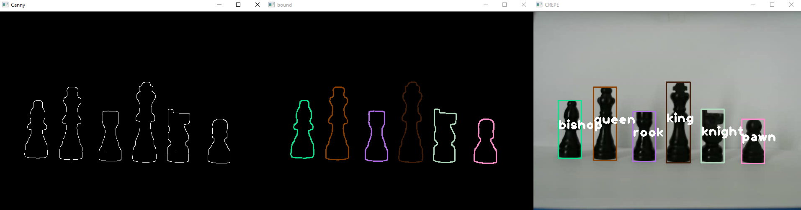
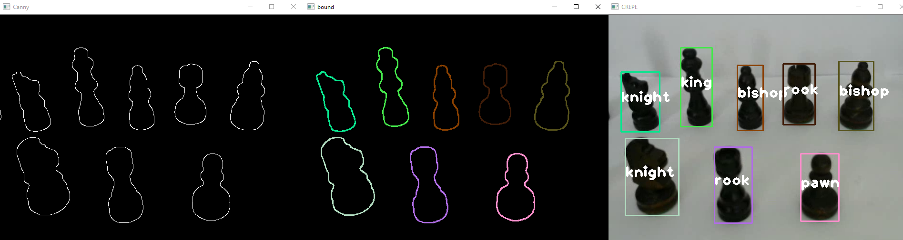

# Chess Recognition Enhanced and Parallelized Engine (CREPE)

CREPE is a real-time chess pieces recognition project written in C++. The goal is to match shapes of a given database to chess pieces of a picture, a video or a recording camera.
The project is using CUDA for GPU computations. It gets every shapes for each frame and matches them to the database's shapes using Fourier descriptors.

                                                                                                                                                      
                                                    

A screenshot of the presentation video 

A second one with 30° angle 

## Requirements

This project has been tested with :
- Visual studio 2017
- CMake 3.12.2
- Cuda 10.0.0 
- opencv-3.4.3 (with GPU module)
- Qt5.11.2

## Build CREPE

You will first need to build OpenCV with its CUDA modules.  (A very good tutorial for windows can be found following this 
[link](https://inside.mines.edu/~whoff/courses/EENG510/lectures/other/CompilingOpenCV.pdf))

You can then build the project by using CMake and generate the visual studio solution. The project should work for older visual studio and opencv version. 

You can test if it is working with demo videos in the directory sample . 

## How to modify the database

You can modify the database pretty easily by just adding/deleting pictures in the database directory. Beware that you must not modify the name of directories (bishop, king, knight, ...) in this version of CREPE. The program behaviour and recognition will be modified as you modify the database.

## How it works

#### Image preprocessing

The preprocessing wasn't the main objective of this project and thus we used OpenCV functions mostly.
* We first apply a gaussian blur to reduce noise.
* We then get the grayscale version of the current frame.
* Finally, A  canny edge detector is applied as it is a very efficient way to detect edges.

#### Edge linking

As a camera approach doesn't give perfects results, an edge might have several holes. To prevent this, we did two things. First, we applied a dilatation to edges to fill-up the holes. However, our edges were now far bigger than needed. To reduce it, we used the
Zhang-Suen thinning algorithm which is pretty straightforward to implement on GPU. As a result, the edges were full and openCV findcontours algorithm worked perfectly well.

#### Fourier descriptors

The program first compute the Fourier descriptors for the whole database. We did the followings steps to get proper Fourier descriptors
* We first normalized every shape to 256 pixels using a very simple algorithm.
* Then, we used the centroïd distance to express every point according to this.
* The FFT can now be applied.
* The points obtained are descriptors and can be compared to other shapes using a simple euclidian distance.

To anyone wanting to dig a bit deeper in fourier descriptors method, I'd recommend this wonderful 
[article](http://citeseerx.ist.psu.edu/viewdoc/download?doi=10.1.1.67.2229&rep=rep1&type=pdf)  which is very understandable and sums up very well the process.

#### Object matching

Once the database is processed, we only need to compute everything we did previously back again with the current frame and to compare the descriptors. We then classify the shape given the score we get compared to each kind of pieces.
